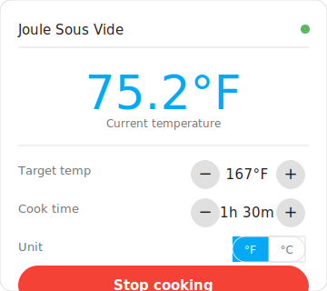

# ChefSteps Joule Sous Vide — Home Assistant Integration

Control and monitor your **ChefSteps Joule** circulator directly from Home Assistant, without the ChefSteps app.



> **Status: v0.6 — Functional.** The integration communicates with the Joule over BLE using reverse-engineered protobuf messages. Real-hardware validation is in progress. See [Known Limitations](#known-limitations).

---

## What You Get

Once set up, Home Assistant creates five entities for your Joule, all under a single **ChefSteps Joule Sous Vide** device:

| Entity | Type | What it does |
|---|---|---|
| **Current Temperature** | Sensor | Live water temperature in °C, updated every 30 seconds |
| **Sous Vide** | Switch | Starts and stops the cooking cycle |
| **Target Temperature** | Number | Temperature to heat to (displayed in °F or °C, default °F) |
| **Cook Time** | Number | How long to cook in minutes (0 = no time limit) |
| **Temperature Unit** | Select | Choose °F or °C for the Target Temperature display (persisted across restarts) |

---

## Requirements

- Home Assistant **2024.2** or newer
- Your HA host within **~10 metres** of the Joule (Bluetooth range)
- The Joule **powered on** and not connected to the ChefSteps app
- The Joule's **Bluetooth MAC address** (see [Finding Your MAC Address](#finding-your-mac-address))

---

## Installation

### Method 1 — HACS (recommended)

[HACS](https://hacs.xyz) is the Home Assistant Community Store. It handles installation and updates automatically.

**Step 1 — Install the integration**

1. Make sure [HACS is installed](https://hacs.xyz/docs/use/).
2. In Home Assistant, go to **HACS** → **Integrations**.
3. Click **⋮** → **Custom repositories**, add `https://github.com/acato/ha-joule`, category **Integration**.
4. Search for **ChefSteps Joule Sous Vide** and click **Download**.
5. **Restart Home Assistant.**

**Step 2 — Install the Lovelace card**

1. In HACS, go to **Frontend**.
2. Click **⋮** → **Custom repositories**, add `https://github.com/acato/ha-joule`, category **Frontend**.
3. Search for **ChefSteps Joule Sous Vide** and click **Download**.
4. **Reload the browser tab.**

> The card is now available in the card picker. See [How To: Use the Custom Lovelace Card](docs/how-to-lovelace-card.md) for setup instructions.

### Method 2 — Manual

1. Copy the `custom_components/joule_sous_vide/` folder into the `custom_components/` directory inside your HA configuration directory.
2. **Restart Home Assistant.**
3. The Lovelace card is served automatically — register `/joule_sous_vide/joule-card.js` as a Lovelace resource (JavaScript module) and reload the browser.

### Add the integration

1. Go to **Settings** → **Devices & Services** → **+ Add Integration**.
2. Search for **Joule** and select **ChefSteps Joule Sous Vide**.
3. Enter your Joule's Bluetooth MAC address (`AA:BB:CC:DD:EE:FF`) and click **Submit**.

> ✅ On success, a **"Joule AA:BB:CC:DD:EE:FF"** device appears with five entities ready to use.

---

## Finding Your MAC Address

**Easiest — phone app:**
1. Install a free Bluetooth scanner (iOS/Android: "nRF Connect" or "BLE Scanner").
2. Power on your Joule and open the app.
3. Scan for devices and look for one named **"Joule"**.
4. The address shown (e.g. `D4:9A:20:01:F3:8B`) is what you need.

**Linux / Raspberry Pi host:**
```bash
bluetoothctl scan on
# Wait a few seconds, find the entry named "Joule", press Ctrl+C to stop
```

---

## Using the Integration

**Set your temperature:** Adjust the **Target Temperature** number entity to your desired setpoint before starting. Use the **Temperature Unit** selector to choose °F or °C — your preference is saved across restarts.

**Set cook time:** Set the **Cook Time** number entity (in minutes). Leave it at 0 for no time limit.

**Start a cooking session:** Toggle the **Sous Vide** switch on. The Joule reads the current Target Temperature and Cook Time values and begins heating.

**Stop cooking:** Toggle the switch off. The Joule stops immediately.

**Monitor temperature:** The **Current Temperature** sensor updates every 30 seconds and works in dashboards, automations, and templates.

**Automate:** Use standard HA automations to schedule cooks, send alerts when the target temperature is reached, or control the Joule with a voice assistant.

```yaml
# Example: notify when the bath is up to temperature
trigger:
  - platform: numeric_state
    entity_id: sensor.joule_current_temperature
    above: 59.5
action:
  - service: notify.mobile_app
    data:
      message: "Water bath is ready!"
```

---

## Known Limitations

| Limitation | Details |
|---|---|
| **BLE protocol** | The protobuf message format is based on reverse-engineering of the [chromeJoule](https://github.com/li-dennis/chromeJoule) project. Commands may not work on all firmware versions. |
| **State polling delay** | Cooking state is read from the device every 30 seconds via `program_step`. Between polls, state may be stale if the Joule is controlled from the ChefSteps app. |
| **One connection at a time** | Bluetooth only supports one active connection. Close the ChefSteps app before using this integration. |

---

## Troubleshooting

**Entities show "Unavailable":** The Joule is out of Bluetooth range, powered off, or another app has the connection. The integration reconnects automatically once the device is available again.

**"Failed to connect" during setup:** Check the Joule is powered on, within range, and not connected to the ChefSteps app. Double-check the MAC address format (`AA:BB:CC:DD:EE:FF` with colons, uppercase).

**Integration not appearing in the search:** Make sure the folder is named exactly `joule_sous_vide`, is inside the `custom_components/` directory, and Home Assistant was restarted after copying it.

For full troubleshooting steps, see **[docs/troubleshooting.md](docs/troubleshooting.md)**.

---

## Documentation

- [Getting Started](docs/getting-started.md)
- [How To: Start a Cooking Session](docs/how-to-start-cooking.md)
- [How To: Monitor Temperature](docs/how-to-monitor-temperature.md)
- [How To: Automate Your Joule](docs/how-to-automate.md)
- [How To: Use the Custom Lovelace Card](docs/how-to-lovelace-card.md)
- [Entity Reference](docs/reference-entities.md)
- [Troubleshooting](docs/troubleshooting.md)
- [Advanced: Finding BLE UUIDs with nRF Connect](docs/how-to-find-uuids.md)

---

## Road Map

These are the next planned improvements, in priority order:

### ~~1 — Set a target temperature~~ ✅ Done

Two `number` entities — **Target Temperature** and **Cook Time** (0–1440 min) — let you set cooking parameters from the dashboard or an automation. When the Sous Vide switch is turned on it reads the current values and passes them to the device. A **Temperature Unit** `select` entity (default °F) controls whether the target temperature is displayed and entered in °F or °C; the device always receives °C internally. The unit preference is persisted to the config entry and survives Home Assistant restarts.

### ~~2 — Custom Lovelace card~~ ✅ Done

A `custom:joule-sous-vide-card` Lovelace card that shows current temperature, target temperature (with +/− steppers), cook time (with +/− steppers), a °F/°C unit toggle, and a Start/Stop button — all in one panel. The card is served automatically by the integration at `/joule_sous_vide/joule-card.js`; add it as a Lovelace resource and it appears in the card picker. See [How To: Use the Custom Lovelace Card](docs/how-to-lovelace-card.md).

### ~~3 — HACS integration and install workflow~~ ✅ Done

Added `hacs.json`, a GitHub Actions release workflow (triggered by version tags, validates `manifest.json` version, publishes a zip as a GitHub Release), and a CI workflow that runs the test suite on every push. The integration can now be installed via HACS as a custom repository.

### ~~4 — Real BLE UUIDs and protobuf message layer~~ ✅ Done

Replaced placeholder BLE UUIDs with real values reverse-engineered from [chromeJoule](https://github.com/li-dennis/chromeJoule). Implemented a hand-rolled protobuf encoder/decoder in `joule_proto.py` (no external dependencies) covering `StartProgramRequest`, `StopCirculatorRequest`, `BeginLiveFeedRequest`, and `CirculatorDataPoint`. The coordinator now polls via `BeginLiveFeedRequest`, reads live temperature from `CirculatorDataPoint.bath_temp`, and derives cooking state from the device's `program_step` field.

---

## Contributing

Issues and pull requests are welcome at [github.com/acato/ha-joule](https://github.com/acato/ha-joule).

When reporting a bug, please include your Home Assistant version and the relevant log lines from `joule_sous_vide` (Settings → System → Logs).
