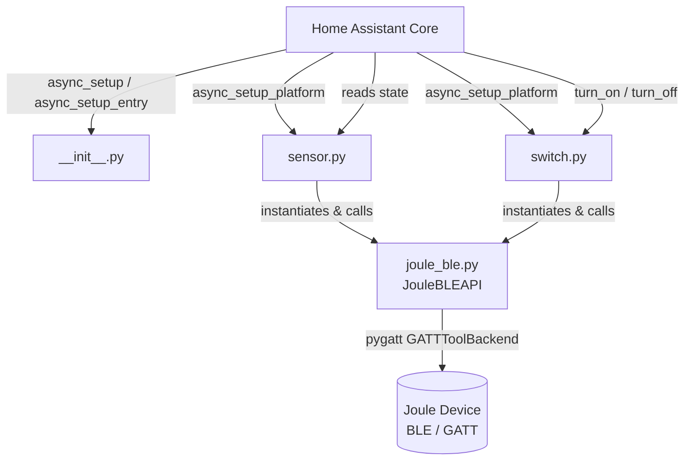
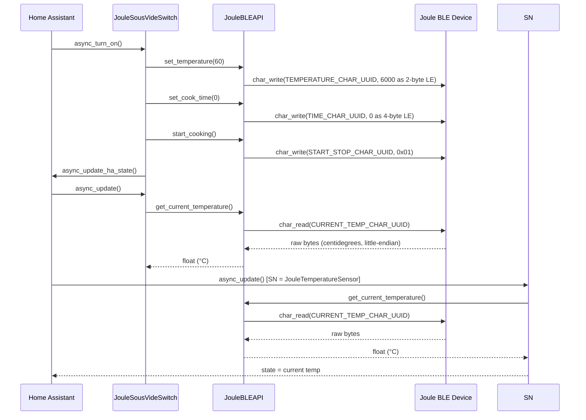
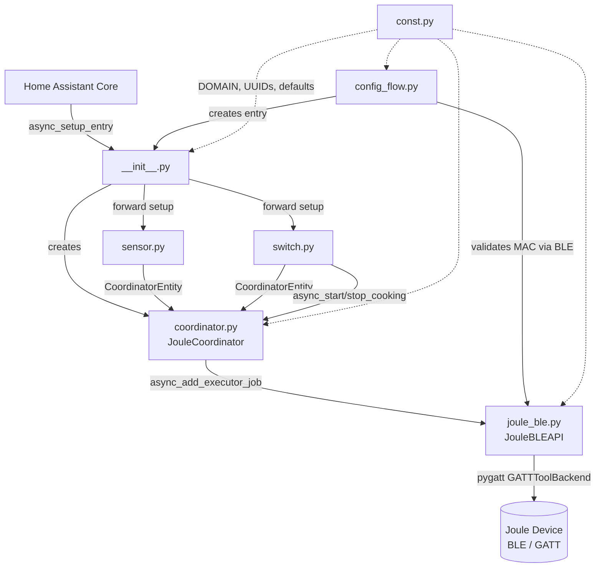

# Architecture: ChefSteps Joule Sous Vide — Home Assistant Integration

## Overview

This integration connects Home Assistant to a **ChefSteps Joule Sous Vide** device over **Bluetooth Low Energy (BLE)**. It exposes two HA entities:

- A **sensor** that reads the current water temperature from the device.
- A **switch** that starts and stops the cooking process (setting temperature and cook time before starting).

Communication with the physical device goes exclusively through `JouleBLEAPI`, which wraps the `pygatt` GATT library.

---

## Component Diagram



---

## Data Flow



---

## File-by-File Function Reference

### `__init__.py` — Integration Entry Point

| Function | Signature | What it does |
|---|---|---|
| `async_setup` | `(hass, config) → bool` | Legacy YAML-based setup hook. Logs that the component is loading and returns `True`. Does not initialize any connections. |
| `async_setup_entry` | `(hass, entry: ConfigEntry) → bool` | Config-entry setup hook called by HA when an entry is loaded. Ensures `hass.data[DOMAIN]` exists, then calls a placeholder `your_joule_library.connect_to_joule()` (not yet implemented) and stores the result under the entry ID. Returns `True`. |

> **Note:** `async_setup_entry` currently references a non-existent `your_joule_library`. This is a stub that must be replaced with real `JouleBLEAPI` initialization.

---

### `joule_ble.py` — BLE API Client (`JouleBLEAPI`)

All methods are **synchronous** and perform blocking I/O. They must be called from a thread pool (via `hass.async_add_executor_job`) when used inside HA's async event loop.

| Method | Signature | What it does |
|---|---|---|
| `__init__` | `(mac_address: str)` | Stores the device MAC address. Creates a `pygatt.GATTToolBackend` adapter instance. Sets `self.device = None` (not yet connected). |
| `connect` | `() → None` | Starts the GATT adapter (`adapter.start()`), then connects to the Joule at the stored MAC address. Stores the connected device handle in `self.device`. Logs success or catches and logs `BLEError` on failure. |
| `disconnect` | `() → None` | Disconnects the device if connected (`device.disconnect()`), then stops the adapter (`adapter.stop()`). Catches and logs `BLEError`. |
| `set_temperature` | `(temperature: float) → None` | Converts target temperature from °C to centidegrees (`× 100`), encodes as a 2-byte little-endian integer, and writes to `TEMPERATURE_CHAR_UUID` on the device. |
| `set_cook_time` | `(time_minutes: float) → None` | Converts cooking duration from minutes to seconds (`× 60`), encodes as a 4-byte little-endian integer, and writes to `TIME_CHAR_UUID`. |
| `start_cooking` | `() → None` | Writes the byte `0x01` to `START_STOP_CHAR_UUID` to signal the device to begin cooking. |
| `stop_cooking` | `() → None` | Writes the byte `0x00` to `START_STOP_CHAR_UUID` to signal the device to stop cooking. |
| `get_current_temperature` | `() → float` | Reads raw bytes from `CURRENT_TEMP_CHAR_UUID`, interprets them as a little-endian integer representing centidegrees, divides by 100 to return °C as a float. |

**BLE Characteristic UUIDs** (all currently placeholders):

| Constant | Purpose |
|---|---|
| `JOULE_SERVICE_UUID` | The primary GATT service on the device |
| `TEMPERATURE_CHAR_UUID` | Write: target temperature setpoint |
| `TIME_CHAR_UUID` | Write: desired cook duration |
| `START_STOP_CHAR_UUID` | Write: `0x01` = start, `0x00` = stop |
| `CURRENT_TEMP_CHAR_UUID` | Read: current water temperature |

---

### `sensor.py` — Temperature Sensor Entity (`JouleTemperatureSensor`)

| Function / Property | What it does |
|---|---|
| `async_setup_platform(hass, config, async_add_entities, discovery_info)` | Legacy YAML platform setup. Reads `mac_address` from the YAML config dict. Instantiates a `JouleTemperatureSensor` with that address and registers it with HA via `async_add_entities`. |
| `__init__(mac_address)` | Creates a `JouleBLEAPI` instance, immediately calls `connect()` (blocking, on the event loop — a bug), and sets `self._temperature = None`. |
| `name` *(property)* | Returns the static string `"Joule Current Temperature"`. |
| `state` *(property)* | Returns the last-fetched temperature value (`self._temperature`), or `None` if not yet updated. |
| `async_update()` | Called by HA to refresh state. Calls `JouleBLEAPI.get_current_temperature()` synchronously (blocking — a bug) and stores the result in `self._temperature`. |

---

### `switch.py` — Cooking Control Switch (`JouleSousVideSwitch`)

| Function / Property | What it does |
|---|---|
| `async_setup_platform(hass, config, async_add_entities, discovery_info)` | Legacy YAML platform setup. Reads `mac_address` from config, instantiates `JouleSousVideSwitch`, and registers it with HA. |
| `__init__(mac_address)` | Sets initial state: `_is_on = False`, `_target_temperature = 60` (°C), `_cook_time_minutes = 0`. Creates a `JouleBLEAPI` instance and immediately calls `connect()` (blocking — a bug). |
| `name` *(property)* | Returns the static string `"Joule Sous Vide"`. |
| `is_on` *(property)* | Returns the cached `self._is_on` boolean. Does **not** query the device. |
| `async_turn_on(**kwargs)` | Sends the full cook sequence over BLE: calls `set_temperature(_target_temperature)`, `set_cook_time(_cook_time_minutes)`, then `start_cooking()`. Sets `_is_on = True` and calls `async_update_ha_state()` to push the state change to HA. |
| `async_turn_off(**kwargs)` | Calls `stop_cooking()` over BLE. Sets `_is_on = False` and calls `async_update_ha_state()`. |
| `device_state_attributes` *(property)* | Returns a dict with `target_temperature` and `cook_time_minutes` as extra attributes visible in HA. |
| `async_update()` | Reads the current temperature from BLE and logs it. Does **not** store the value or expose it as a state attribute. The comment says "add logic to alert when cooking is done" — this is unimplemented. |

---

## Current Architecture (v0.3)

All issues from the original prototype have been resolved. The integration now follows standard HA patterns:

| Issue | Resolution |
|---|---|
| **Blocking I/O in async context** | All `JouleBLEAPI` calls go through `hass.async_add_executor_job()` in the coordinator. |
| **No DataUpdateCoordinator** | `coordinator.py` — `JouleCoordinator` owns the single BLE connection and shares data with all entities. |
| **`async_setup_entry` was a stub** | `__init__.py` rewritten: creates coordinator, raises `ConfigEntryNotReady` on failure. |
| **No `config_flow.py`** | Added — prompts for MAC address and validates via a real BLE connection attempt. |
| **No `const.py`** | Added — `DOMAIN`, BLE UUIDs, and defaults defined once and imported everywhere. |
| **No unique IDs on entities** | Both entities now set `_attr_unique_id` using `entry.entry_id`. |
| **BLE connect in constructor** | Removed — `ensure_connected()` is called lazily inside `_async_update_data`. |
| **`async_update` in switch incomplete** | Removed — switch is a `CoordinatorEntity`; state comes from `coordinator.data`. |
| **`requirements` mismatch** | Fixed — `manifest.json` now lists `pygatt` and adds `config_flow: true`, `iot_class: local_polling`. |

### One Remaining Limitation

Cooking state (`is_cooking`) is tracked internally by the coordinator rather than read back from the device. This means if the device is turned on/off by a means other than Home Assistant (e.g. the ChefSteps app), HA's state will be stale until the next manual interaction. This is a limitation of the BLE protocol — the `START_STOP_CHAR_UUID` characteristic is write-only.

---

## Current File Structure

```
custom_components/joule_sous_vide/
├── __init__.py           # Entry setup / unload
├── config_flow.py        # UI configuration (MAC address input)
├── coordinator.py        # JouleCoordinator — BLE connection owner
├── joule_ble.py          # JouleBLEAPI — synchronous BLE I/O
├── sensor.py             # JouleTemperatureSensor (CoordinatorEntity)
├── switch.py             # JouleSousVideSwitch (CoordinatorEntity)
├── const.py              # DOMAIN, UUIDs, defaults
├── manifest.json         # Integration metadata
├── strings.json          # Config flow UI strings
└── translations/
    └── en.json           # English translations
```

---

## Implemented Architecture


