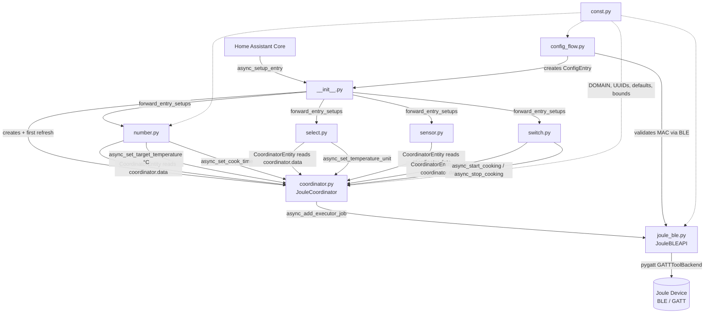
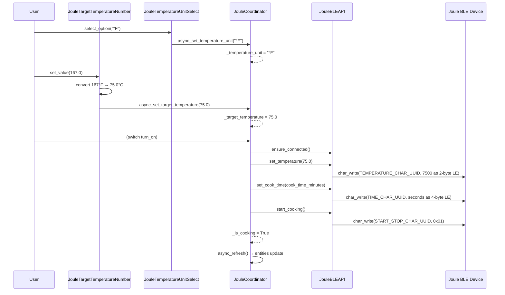
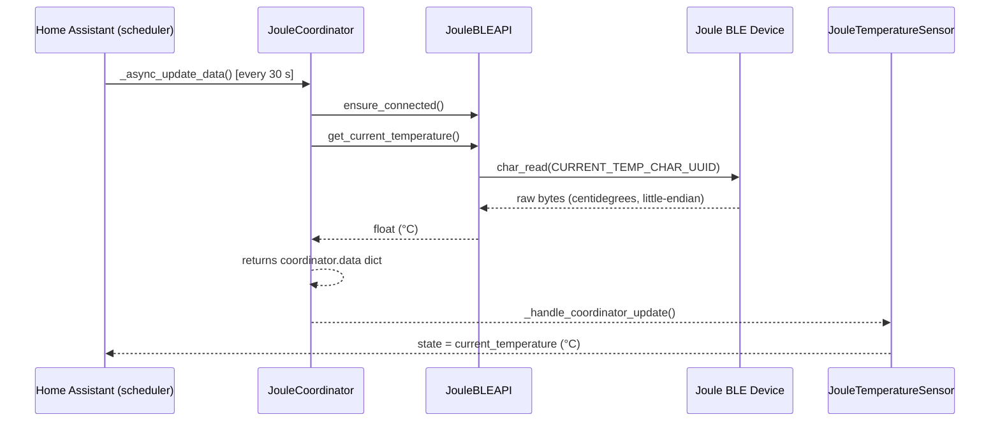

# Architecture: ChefSteps Joule Sous Vide — Home Assistant Integration

## Overview

This integration connects Home Assistant to a **ChefSteps Joule Sous Vide** device over **Bluetooth Low Energy (BLE)**. It exposes five HA entities across four platforms:

| Platform | Entity | Purpose |
|---|---|---|
| `sensor` | Current Temperature | Live water temperature read from device (°C) |
| `switch` | Sous Vide | Starts / stops the cooking cycle |
| `number` | Target Temperature | Sets the temperature to heat to (displayed in °F or °C) |
| `number` | Cook Time | Sets the cook duration in minutes (0 = unlimited) |
| `select` | Temperature Unit | Chooses the display unit for Target Temperature (°F default) |

All communication with the physical device goes exclusively through `JouleBLEAPI`, which wraps the `pygatt` GATT library. Entities never access BLE directly — they call coordinator methods and read from `coordinator.data`.

---

## Component Diagram



---

## Temperature Unit Architecture

The integration maintains a strict separation between **display units** and **internal units**:

```
User sets Target Temperature (e.g. 167 °F)
        │
        ▼
JouleTargetTemperatureNumber.async_set_native_value(167)
        │  converts °F → °C: (167 - 32) × 5/9 = 75.0
        ▼
coordinator._target_temperature = 75.0  (always °C)
        │
        ├──► coordinator.data["target_temperature"] = 75.0
        │           read back by number entity → displayed as 167 °F
        │
        └──► async_start_cooking(75.0, ...) → api.set_temperature(75.0)
                                                BLE device always receives °C
```

The `JouleTemperatureUnitSelect` entity only changes `coordinator._temperature_unit`; it never touches `_target_temperature`. All conversions are localised to `number.py`.

---

## Data Flow: Start a Cooking Session



## Data Flow: Periodic Temperature Poll



---

## File-by-File Function Reference

### `__init__.py` — Integration Entry Point

| Function | Signature | What it does |
|---|---|---|
| `async_setup_entry` | `(hass, entry) → bool` | Creates a `JouleCoordinator`, calls `async_config_entry_first_refresh()` (raises `ConfigEntryNotReady` on failure), stores the coordinator in `hass.data[DOMAIN][entry.entry_id]`, then forwards setup to all four platforms. |
| `async_unload_entry` | `(hass, entry) → bool` | Unloads all platforms, removes the coordinator from `hass.data`, and calls `coordinator.api.disconnect()`. |

---

### `coordinator.py` — `JouleCoordinator`

Single owner of the BLE connection. Entities read from `coordinator.data` and call coordinator methods for all control operations.

**Internal state** (not read from device — tracked locally):

| Attribute | Type | Default | Description |
|---|---|---|---|
| `_is_cooking` | `bool` | `False` | Whether a cook is in progress |
| `_target_temperature` | `float` | `60.0` | Target temperature in **°C** |
| `_cook_time_minutes` | `float` | `0.0` | Cook duration (0 = unlimited) |
| `_temperature_unit` | `str` | `"°F"` | Display unit preference — loaded from `entry.options["temperature_unit"]` on startup, persisted there on change |

**`coordinator.data` keys** (refreshed every 30 s):

| Key | Type | Description |
|---|---|---|
| `current_temperature` | `float` | Latest temperature read from device (°C) |
| `is_cooking` | `bool` | Mirrors `_is_cooking` |
| `target_temperature` | `float` | Mirrors `_target_temperature` (°C) |
| `cook_time_minutes` | `float` | Mirrors `_cook_time_minutes` |
| `temperature_unit` | `str` | Mirrors `_temperature_unit` |

**Methods:**

| Method | What it does |
|---|---|
| `_async_update_data()` | Polls the device via `ensure_connected()` + `get_current_temperature()`. Raises `UpdateFailed` on `JouleBLEError`, causing all `CoordinatorEntity` instances to go unavailable. |
| `async_start_cooking(target_temperature, cook_time_minutes)` | Stores parameters, sends the BLE sequence (`set_temperature` → `set_cook_time` → `start_cooking`), sets `_is_cooking = True`, calls `async_refresh()`. |
| `async_stop_cooking()` | Sends `stop_cooking()` over BLE, sets `_is_cooking = False`, calls `async_refresh()`. |
| `async_set_target_temperature(value_celsius)` | Updates `_target_temperature` (°C) and refreshes. No BLE call. |
| `async_set_cook_time(value)` | Updates `_cook_time_minutes` and refreshes. No BLE call. |
| `async_set_temperature_unit(unit)` | Updates `_temperature_unit`, persists the value to `ConfigEntry.options` via `async_update_entry`, and refreshes. No BLE call, no conversion of the stored °C temperature. |

> `async_refresh()` is used (not `async_request_refresh()`) because control actions require immediate state reflection. `async_request_refresh` is debounced and would delay the state update.

---

### `joule_ble.py` — `JouleBLEAPI`

All methods are **synchronous** and must be called via `hass.async_add_executor_job`.

| Method | What it does |
|---|---|
| `__init__(mac_address)` | Stores MAC address, creates a `pygatt.GATTToolBackend`, sets `self.device = None`. |
| `ensure_connected()` | No-op if already connected. Otherwise starts the adapter and connects to the device. Raises `JouleBLEError` on failure. |
| `disconnect()` | Disconnects the device and stops the adapter. |
| `set_temperature(temperature_celsius)` | Converts °C × 100 → 2-byte LE int, writes to `TEMPERATURE_CHAR_UUID`. |
| `set_cook_time(time_minutes)` | Converts minutes × 60 → 4-byte LE int (seconds), writes to `TIME_CHAR_UUID`. |
| `start_cooking()` | Writes `0x01` to `START_STOP_CHAR_UUID`. |
| `stop_cooking()` | Writes `0x00` to `START_STOP_CHAR_UUID`. |
| `get_current_temperature()` | Reads `CURRENT_TEMP_CHAR_UUID`, decodes as LE centidegrees, returns `float` (°C). |

**BLE Characteristic UUIDs** (all currently placeholders pending hardware verification):

| Constant | Purpose |
|---|---|
| `JOULE_SERVICE_UUID` | Primary GATT service |
| `TEMPERATURE_CHAR_UUID` | Write: target temperature setpoint |
| `TIME_CHAR_UUID` | Write: cook duration |
| `START_STOP_CHAR_UUID` | Write: `0x01` = start, `0x00` = stop |
| `CURRENT_TEMP_CHAR_UUID` | Read: current water temperature |

---

### `sensor.py` — `JouleTemperatureSensor`

| Method / Property | What it does |
|---|---|
| `async_setup_entry(hass, entry, async_add_entities)` | Retrieves the coordinator from `hass.data`, instantiates `JouleTemperatureSensor`, registers it. |
| `__init__(coordinator, entry)` | Sets `unique_id = f"{entry.entry_id}_current_temperature"`, configures device info. |
| `native_value` *(property)* | Returns `coordinator.data["current_temperature"]` (°C). `None` if data is unavailable. |

Static attributes: `device_class=TEMPERATURE`, `state_class=MEASUREMENT`, `unit=°C`.

---

### `switch.py` — `JouleSousVideSwitch`

| Method / Property | What it does |
|---|---|
| `async_setup_entry(hass, entry, async_add_entities)` | Retrieves coordinator, instantiates and registers `JouleSousVideSwitch`. |
| `__init__(coordinator, entry)` | Sets `unique_id = f"{entry.entry_id}_switch"`, configures device info. |
| `is_on` *(property)* | Returns `coordinator.data["is_cooking"]`. |
| `extra_state_attributes` *(property)* | Exposes `target_temperature` (°C) and `cook_time_minutes` from `coordinator.data`. |
| `async_turn_on(**kwargs)` | Reads `target_temperature` and `cook_time_minutes` from `coordinator.data`, calls `coordinator.async_start_cooking(temp_c, time)`. |
| `async_turn_off(**kwargs)` | Calls `coordinator.async_stop_cooking()`. |

---

### `number.py` — `JouleTargetTemperatureNumber` and `JouleCookTimeNumber`

#### `JouleTargetTemperatureNumber`

| Method / Property | What it does |
|---|---|
| `__init__(coordinator, entry)` | Sets `unique_id = f"{entry.entry_id}_target_temperature"`. |
| `_current_unit()` | Returns `coordinator.data["temperature_unit"]` (°F by default). |
| `native_unit_of_measurement` *(property)* | Returns the current display unit (°F or °C). |
| `native_min_value` *(property)* | Returns 32.0 (°F) or 0.0 (°C) depending on current unit. |
| `native_max_value` *(property)* | Returns 212.0 (°F) or 100.0 (°C) depending on current unit. |
| `native_step` *(property)* | Returns 1.0 (°F) or 0.5 (°C). |
| `native_value` *(property)* | Reads `coordinator.data["target_temperature"]` (°C) and converts to the display unit for presentation. |
| `async_set_native_value(value)` | Converts the input from the display unit to °C, calls `coordinator.async_set_target_temperature(value_celsius)`. |

#### `JouleCookTimeNumber`

Static attributes: `unit="min"`, `min=0`, `max=1440`, `step=1`. No unit conversion needed.

| Method / Property | What it does |
|---|---|
| `native_value` *(property)* | Returns `coordinator.data["cook_time_minutes"]`. |
| `async_set_native_value(value)` | Calls `coordinator.async_set_cook_time(value)` directly. |

---

### `select.py` — `JouleTemperatureUnitSelect`

| Method / Property | What it does |
|---|---|
| `__init__(coordinator, entry)` | Sets `unique_id = f"{entry.entry_id}_temperature_unit"`. Options: `["°F", "°C"]`. |
| `current_option` *(property)* | Returns `coordinator.data["temperature_unit"]`. |
| `async_select_option(option)` | Calls `coordinator.async_set_temperature_unit(option)`. |

---

### `config_flow.py` — `JouleConfigFlow`

| Method | What it does |
|---|---|
| `async_step_user(user_input)` | Shows MAC address input form. On submit, attempts `ensure_connected()` + `disconnect()` to validate the address. Calls `async_set_unique_id(mac)` and aborts if already configured. Creates the config entry on success. |

---

## Repository Structure

```
.github/
├── workflows/
│   ├── ci.yml          # Runs tests on push/PR to main
│   └── release.yml     # Packages and publishes a release on v* tag push
hacs.json               # HACS custom repository manifest
custom_components/joule_sous_vide/
├── __init__.py           # Entry setup / unload; registers 4 platforms
├── config_flow.py        # UI configuration (MAC address input + BLE validation)
├── coordinator.py        # JouleCoordinator — single BLE connection owner
├── joule_ble.py          # JouleBLEAPI — synchronous BLE I/O (pygatt)
├── number.py             # Target Temperature + Cook Time number entities
├── select.py             # Temperature Unit select entity
├── sensor.py             # Current Temperature sensor entity
├── switch.py             # Sous Vide switch entity
├── const.py              # DOMAIN, UUIDs, defaults, temperature bounds
├── manifest.json         # Integration metadata
├── strings.json          # Config flow UI strings
└── translations/
    └── en.json           # English translations
```

---

## Architectural Constraints and Known Limitations

| Constraint | Detail |
|---|---|
| **Cooking state is write-only** | `is_cooking` is tracked internally. If the device is stopped from the ChefSteps app or loses power, HA will not detect the change automatically. |
| **BLE UUIDs are unverified** | All GATT characteristic UUIDs are placeholders pending confirmation against real hardware. |
| **One BLE connection at a time** | `pygatt` holds a single connection per `JouleBLEAPI` instance. The ChefSteps app must be closed while this integration is active. |
| **Temperature unit is persisted** | `_temperature_unit` is written to `ConfigEntry.options` on every change and read back on startup. It survives HA restarts. |
